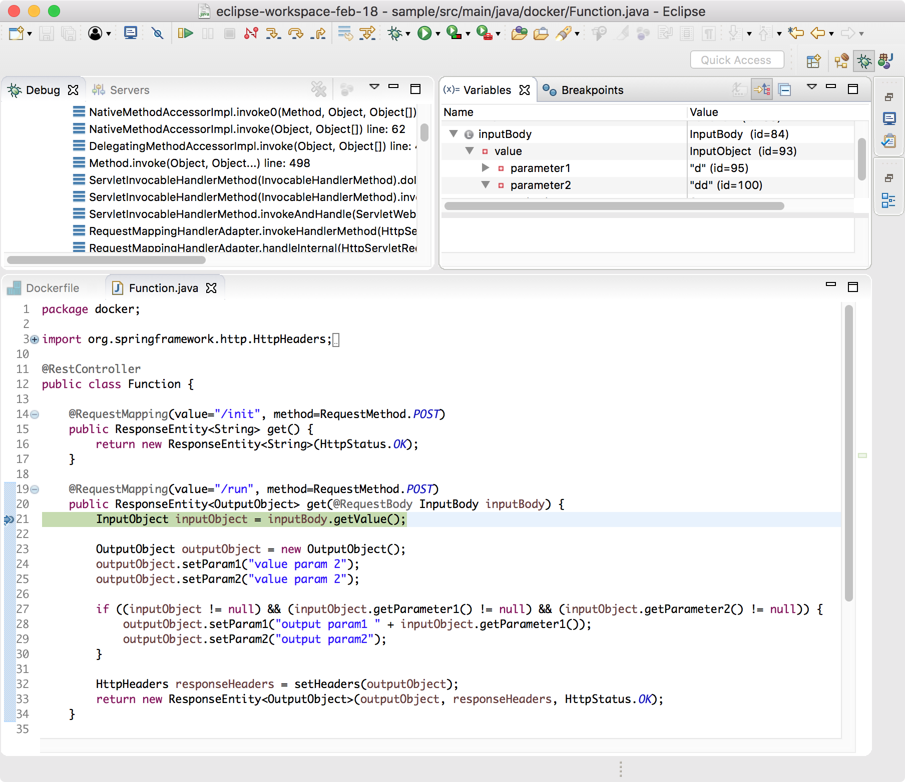

# Developing and debugging OpenWhisk Functions with Spring Boot in Eclipse

This [project](https://github.com/nheidloff/openwhisk-debug-java) shows how [Apache OpenWhisk](http://openwhisk.org/) functions can be developed with [Spring Boot](https://projects.spring.io/spring-boot/). The Java code is built via Maven and then put into a Docker image which can be deployed to OpenWhisk cloud providers like the [IBM Cloud](https://bluemix.net).

The sample describes how the Spring Boot code can be developed in a local Eclipse IDE. The code which runs in a local Docker container can be debugged directly from the IDE. Via the [Spring Boot Developer Tools](https://docs.spring.io/spring-boot/docs/current/reference/html/using-boot-devtools.html) the code can be changed in the IDE and the changes can be run immediately without having to restart the container.

The advantage of this approach is that the development is done in (almost) the same container that runs in the cloud which minimizes the chances to run into issues because of different environments.

Here is a screenshot that shows how Spring Boot code running in Docker can be debugged in the Eclipse IDE:




## Prerequisites

In order to run the code you need the following prerequisites:

* [Java JDK](http://www.oracle.com/technetwork/java/javase/downloads/index.html)
* [Eclipse Java EE IDE for Web Developers](https://www.eclipse.org/downloads/packages/eclipse-ide-java-ee-developers/oxygen3rc2)
* [Docker](https://docs.docker.com/engine/installation/)
* [git](https://git-scm.com/downloads)


## Setup

Run the following commands:

```sh
$ git clone https://github.com/nheidloff/openwhisk-debug-java.git
$ cd openwhisk-debug-java
```

Open Eclipse, choose 'Import existing Maven project' and select the directory 'openwhisk-debug-java/spring'.

In order to test the sample function locally, run a Maven build (see [screenshot](screenshots/config-maven)) and invoke these commands:

```sh
$ docker build -t openwhisk-docker-spring-boot:latest .
$ docker run -p 8080:8080 --rm=true openwhisk-docker-spring-boot:latest
$ curl --request POST \
  --url http://localhost:8080/run \
  --header 'Cache-Control: no-cache' \
  --header 'Content-Type: application/json' \  
  --data '{ "value": {"parameter1":"Niklas","parameter2":"Heidloff"}}'
```


## Deployment

In order to deploy the functions to IBM Cloud Functions, replace 'your-ibm-cloud-organization', 'your-ibm-cloud-space' and 'dockerhub-name' and run the following commands:

```sh
$ bx login -a api.ng.bluemix.net
$ bx target -o <your-ibm-cloud-organization> -s <your-ibm-cloud-space>
$ bx plugin install Cloud-Functions -r Bluemix
$ docker build -t <dockerhub-name>/openwhisk-docker-spring-boot:latest .
$ docker push <dockerhub-name>/openwhisk-docker-spring-boot
$ bx wsk action create actionDockerSpring --docker <dockerhub-name>/openwhisk-docker-spring-boot:latest
$ bx wsk action invoke --blocking actionDockerSpring --param-file parameters.json
```

After you've changed the functions and created them on IBM Cloud Functions, use 'bx wsk action update' instead of 'bx wsk action create'.


## Debugging

In order to debug code, run the following command:

```sh
$ docker-compose up --build
```

Next you need to configure the remote debugger. Create a new debug configuration, set 'Function' as project and '5005' as port (see [screenshot](screenshots/config-debugger)).

After this you can set debug points and trigger the function via this curl command:

```sh
$ curl --request POST \
  --url http://localhost:8080/run \
  --header 'Cache-Control: no-cache' \
  --header 'Content-Type: application/json' \  
  --data '{ "value": {"parameter1":"Niklas","parameter2":"Heidloff"}}'
```